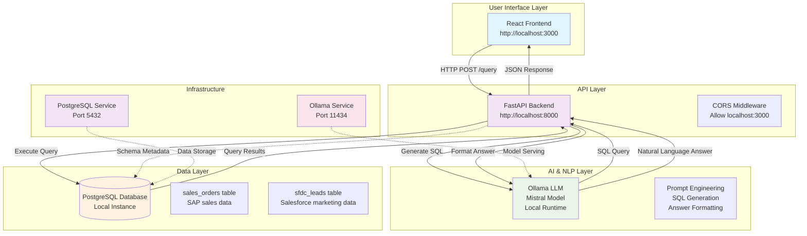
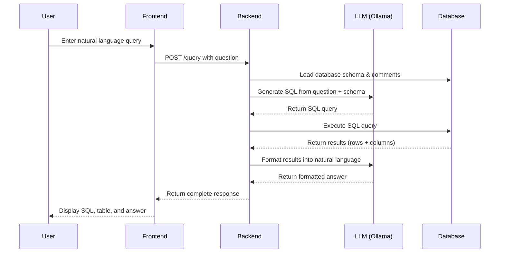

# AI Data Assistant - Architecture Overview

## System Architecture

## Architecture Components

### 1. Frontend Layer (React)
- **Technology**: React 18+ with modern hooks
- **Purpose**: User interface for natural language queries
- **Features**:
  - Query input form
  - Results display (SQL + data table + AI answer)
  - Responsive design
  - Real-time loading states
- **Communication**: HTTP POST to `/query` endpoint

### 2. Backend Layer (FastAPI)
- **Technology**: FastAPI with async support
- **Purpose**: API orchestration and business logic
- **Key Components**:
  - **CORS Middleware**: Enables cross-origin requests from React frontend
  - **Query Processing**: Handles user questions and orchestrates RAG pipeline
  - **Database Connection**: PostgreSQL connection pooling
  - **Error Handling**: Comprehensive error handling for LLM timeouts and failures
- **Endpoints**:
  - `POST /query`: Main query processing endpoint

### 3. AI Layer (Ollama + Mistral)
- **Technology**: Ollama local LLM runtime
- **Model**: Mistral 7B (4.4GB)
- **Purpose**: Natural language processing for SQL generation and answer formatting
- **Two-Phase Processing**:
  1. **SQL Generation**: Convert natural language to PostgreSQL queries
  2. **Answer Formatting**: Convert SQL results to natural language responses
- **Configuration**:
  - Temperature: 0 (deterministic for SQL), 0.5 (creative for answers)
  - Max tokens: 120-250 depending on phase
  - Timeout: 120 seconds

### 4. Data Layer (PostgreSQL)
- **Technology**: PostgreSQL 13+
- **Purpose**: Structured data storage and querying
- **Schema**:
  - **sales_orders**: SAP sales transaction data
    - Fields: order_id, order_date, customer_name, segment, country, region, product_name, category, sub_category, quantity, sales, discount, profit
    - Volume: 40+ records with realistic business data
  - **sfdc_leads**: Salesforce marketing leads
    - Fields: lead_id, created_date, lead_source, lead_status, campaign_name, email, phone, company, industry, score, converted
    - Volume: 30+ records with marketing campaign data
- **Features**:
  - Column comments for enhanced RAG context
  - Indexing on key fields for performance

### 5. Infrastructure Layer
- **Ollama Service**: Local LLM server (port 11434)
- **PostgreSQL Service**: Local database server (port 5432)
- **Development Setup**: All services run locally for development

## Data Flow Architecture

### RAG Pipeline Implementation

### Query Processing Steps

1. **Schema Loading**: Backend loads database schema with column descriptions
2. **SQL Generation**: LLM converts natural language to PostgreSQL using schema context
3. **Query Execution**: Backend executes SQL against PostgreSQL
4. **Result Formatting**: LLM converts tabular results to natural language answer
5. **Response Assembly**: Backend combines SQL, results, and answer into JSON response

## Technology Stack

### Core Technologies
- **Frontend**: React 18, JavaScript, HTML5, CSS3
- **Backend**: Python 3.13+, FastAPI, Uvicorn
- **Database**: PostgreSQL 13+
- **AI/ML**: Ollama, Mistral 7B LLM
- **Data Processing**: psycopg2, pandas (for data loading)

### Development Tools
- **Environment**: Virtual environment (venv)
- **Package Management**: pip, requirements.txt
- **Version Control**: Git
- **Documentation**: Markdown, Mermaid diagrams

### Infrastructure
- **Local Development**: All services run locally
- **Container Ready**: Can be containerized with Docker
- **Cross-Platform**: Windows/Linux/Mac support

## Security Considerations

### Data Protection
- **Local Execution**: All data stays on local machine
- **No External APIs**: No data sent to third-party services
- **Database Security**: Local PostgreSQL with proper authentication

### API Security
- **CORS Configuration**: Restricted to localhost origins
- **Input Validation**: FastAPI automatic validation
- **Error Handling**: No sensitive information in error messages

## Performance Characteristics

### Response Times
- **Simple Queries**: 5-15 seconds
- **Complex Queries**: 30-90 seconds (LLM processing)
- **Database Queries**: <1 second (indexed tables)

### Scalability Considerations
- **Local Deployment**: Limited by hardware resources
- **Model Size**: Mistral 7B fits in 8GB RAM
- **Concurrent Users**: Single-user design
- **Data Volume**: Optimized for <100K records

## Deployment Options

### Development Setup
- **Requirements**: Python 3.13+, Node.js 16+, PostgreSQL, Ollama
- **Setup Time**: 5-10 minutes
- **Resource Usage**: 8GB RAM, 10GB disk space

### Production Deployment
- **Containerization**: Docker Compose for all services
- **Scaling**: Separate LLM service for multiple users
- **Database**: Managed PostgreSQL for larger datasets
- **Load Balancing**: Nginx reverse proxy for API

## Monitoring & Observability

### Logging
- **Application Logs**: Structured logging with timestamps
- **Error Tracking**: Comprehensive error handling with context
- **Performance Metrics**: Response times and query statistics

### Health Checks
- **Service Availability**: Ollama and PostgreSQL connectivity checks
- **Model Status**: LLM model loading verification
- **Database Connectivity**: Connection pool monitoring

## Future Enhancements

### Potential Improvements
- **Model Options**: Support for multiple Ollama models
- **Caching**: Query result caching for repeated questions
- **Batch Processing**: Handle multiple queries efficiently
- **Advanced Analytics**: Time-series analysis and forecasting
- **Multi-tenant**: Support for multiple datasets/users

### Integration Possibilities
- **External APIs**: Weather, market data integration
- **File Upload**: CSV/excel data import capabilities
- **Dashboard**: Interactive data visualization
- **API Extensions**: REST API for programmatic access</content>
<parameter name="filePath">d:\Python\AI_Data_Engineer\rag_data_assistant\ARCHITECTURE.md